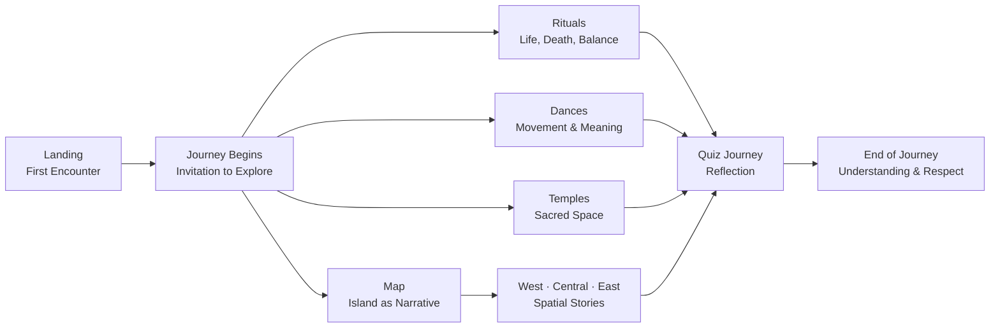

  

###

  
  

###

  

###

<h1 align="center">Nusantara Bali Heritage</h1>

###

<h3 align="left">💻  A Narrative and Interaction Driven Exploration of Balinese Culture</h3>

###

🇬🇧: This project is a digital exploration of Balinese culture, presented in a narrative and educational way. Using a cinematic and interactive approach, the website seeks to provide a contextual understanding of Balinese rituals, dances, architecture, and life philosophy.  🇮🇩: Proyek ini merupakan eksplorasi digital terhadap budaya Bali yang disajikan secara naratif dan edukatif. Dengan pendekatan sinematik dan interaktif, website ini berupaya menghadirkan pemahaman kontekstual tentang ritual, tarian, arsitektur, dan filosofi hidup masyarakat Bali.

###

<h3 align="left">𝚿 Project Philosophy</h3>

###

🇬🇧: This project was born from the belief that culture was never meant to be simply seen. It is experienced through the spaces, rhythms, customs, and meanings shared by its people. Therefore, this website does not position Balinese culture as a visual object, but rather as a narrative experience that invites users to understand the context behind each ritual and tradition. Throughout the process, the boundary between education and sacredness is consciously maintained. Sacred symbols are not modified, polished for aesthetics, or used as decorative elements. Technology here acts as a medium of communication, working behind the scenes to maintain the focus on cultural values, wrapped in technical sophistication.  🇮🇩:  Proyek ini lahir dari keyakinan bahwa budaya tidak pernah dimaksudkan untuk sekadar dilihat. Ia dialami melalui ruang, ritme, kebiasaan, dan makna yang hidup bersama masyarakatnya. Oleh karena itu, website ini tidak memposisikan budaya Bali sebagai objek visual, melainkan sebagai pengalaman naratif yang mengajak pengguna memahami konteks di balik setiap ritual dan tradisi. Dalam prosesnya, batas antara edukasi dan kesakralan dijaga dengan sadar. Simbol sakral tidak dimodifikasi, tidak dipoles demi estetika, dan tidak dijadikan elemen dekoratif. Teknologi di sini berperan sebagai medium penyampai, bekerja di balik layar agar fokus tetap pada nilai budaya, dibalut kecanggihan teknis.

###

<h3 align="left">🧩  Project Structure</h3>

###

###

Key Features: 1. Cinematic Experience 2. Cultural Education 3. Interactive Exploration 4. Quiz & Gamification 5. Ethical Presentation

###

<h3 align="left">🛠 Language and tools</h3>

###

  
  
  
  
  
  
  
  
  
  
  

###

<h3 align="left">© Developer:</h3>

###

Nama: Fatchur Rochman Role: Smartone Software Engineer 2024 - 2027

###
